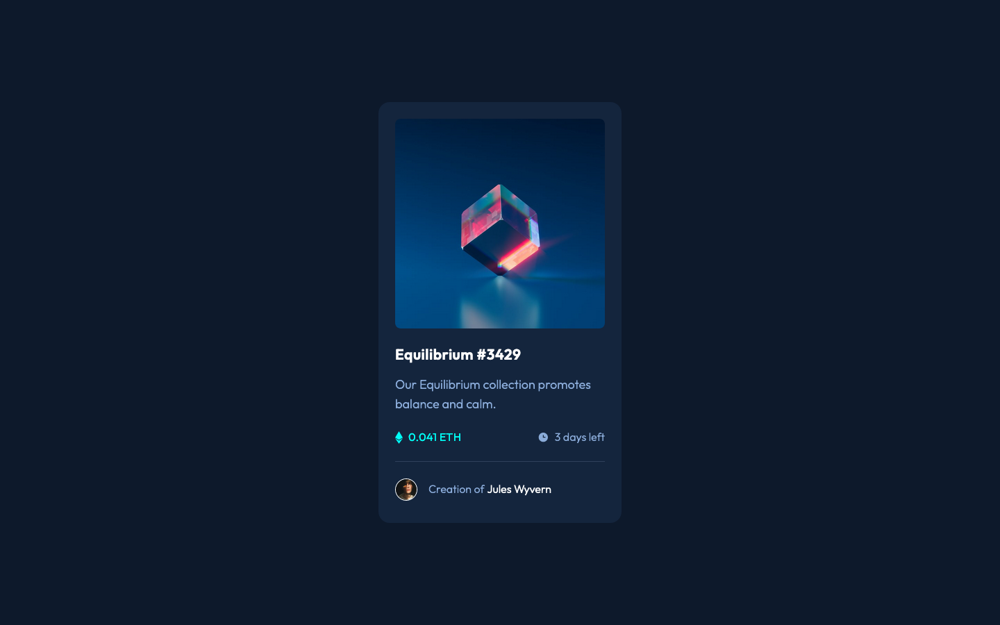

# Frontend Mentor - NFT Preview Card Component Solution

This is a solution to the [NFT Preview Card Component Challenge on Frontend Mentor](https://www.frontendmentor.io/challenges/nft-preview-card-component-SbdUL_w0U). Frontend Mentor challenges help you improve your coding skills by building realistic projects. 

## The challenge

Users should be able to:

- View the optimal layout depending on their device's screen size
- See hover states for interactive elements

## Screenshot

## Built with

- Semantic HTML5 markup
- Tailwind
- Mobile-first workflow

## What I learned

Chose an easy project to practise using Tailwind. The most difficult part of using any framework (in my experience) is the initial configuration and getting it to work in VS Code. I have written a few notes so hopefully I can get it to work again.

## Continued development

I'll try to implement Tailwind in a slightly more complicated project, perhaps one with a hamburger menu.